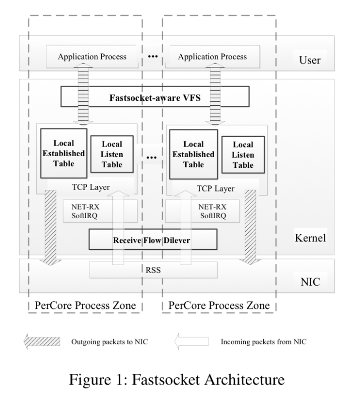
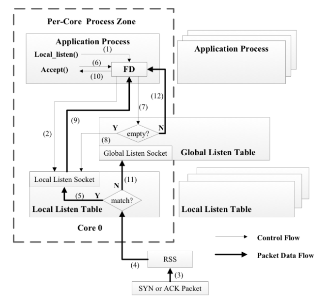
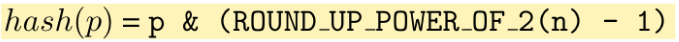

# Scalable Kernel TCP Design and Implementation for Short-Lived Connections
[TOC]

## 概述

近年来，网络带宽，CPU 核数的不断增长，各种应用也需要越来越多的短连接，许多研究人员都已经针对于这样的问题提出了一些设计，但是这些设计难以被应用到现实生产环境中，主要有以下两个原因

- 需要修改原有的应用
- 难以保持后向兼容性

本文正是针对于这样的痛点，提出了 Fastsocket，该设计在保持

- BSD Socket 兼容，不需要应用做改变
- 不消减内核 TCP 栈的所有功能

的情况下，通过

- 表级别的连接分离
- 确保主动连接和被动连接的局部性

实现了可扩展的内核 socket 设计，大大提高了机器的吞吐量，在 24 核机器上达到了 20.4 倍的加速比。

## 介绍

对于目前的短连接应用来说，作者指出，目前

* 典型的请求大小为 600 字节
* 典型的回复的大小大约为1200字节

显然，这些数据都可以放在一个 IP 包中，那么，相比来说，系统在建立连接和终止连接花费的时间比交互的时间要常的多。

对于正常情况的 TCB 管理，无论连接的建立和终止都需要操作全局的 TCBs，它包括了两张全局 hash 表

- listen table
- established table

我们往往需要对其进行访问和更新，由于是全局的，自然也就需要进行加锁。而随着核数的增加，锁竞争的情况会越来越严重。因此，如果能够减少甚至消除这样的锁竞争，会大大减少花费的时间。

与此同时，目前的 VFS 的抽象化设计是针对于所有的 Linux 的所有文件而设计的，不具有特殊性，具有很多 socket 不需要的操作。

与此同时，在生产环境中，往往需要达到以下的目的

* 兼容性
* 安全性
* 资源共享与隔离
要想实现这样的效果，我们需要解决下面的一些问题

- TCB 的管理瓶颈。由于目前的 TCB 管理都是采用全局的，随着核数的不断增加，竞争自然会越来越多。
- 连接的局部性。由于操作系统的中断特性，一个 socket 连接的接收的包和发出的包可能会在不同的 CPU 上处理，那么这就打破了局部性，破坏了缓存。
- 负载和兼容性问题。Linux 的 VFS 对 Socket 进行了抽象，也将其视为一种文件类型，同时将它与 inode 以及 dentry 关联起来。在短连接居多的应用中，如果频繁地建立 socket，就需要不断的分配空间，VFS 就会消耗大量的时间用于管理 inode 以及 dentry。但其实网络和磁盘文件毕竟不一样，我们或许并不需要实现太多。说白了，也就是为某种应用特殊化设计，往往会达到更好地效果。

无论如何，这篇论文希望实现这样一种 socket，在保持

- 目前的所有 Linux socket 的特性
- BSD Socket API 兼容

的情况下，使其

- 适用于短连接居多的应用 

* 高度可扩展性
* 低开销
## Fastsocket Design

### Architecture Overview

作者依据上面的目的实现了 `Fastsocket`，其主要包括三大部分

* 分离的 TCB 数据结构
* 接收流分发器
* fastsocket 敏感的 VFS

更加具体的，作者通过改进

- 共享数据结构
- 绑定核心连接
- VFS 抽象实现

实现了 TCB 管理的局部性，大大加速了短连接应用的处理速度。

### Full Partition of TCB Management

在 TCB 管理方面，作者实现了完整的表级别分离。

对于 Local Listen Table表，作者希望能够同时达到以下几个目的

- 表级别的分离
- 确保 TCP 栈的鲁棒性
- 被动连接的局部性

具体的方法如下

* TCP 内核设置阶段
    * 为每一个 CPU 申请一个本地监听表
    * 维护最原始的全局监听表

* 启动时
    * 应用服务的第一个进程在某个端口监听，等待用户的请求
    * 内核会在 global listen table 中建立监听 socket
    * 服务器端会 fork 多个进程，并将他们绑定到不同的 CPU 核上
    * 子进程继承了 listen socket，而且准备接收新的连接，可以并行处理新的连接

对于更加细节的处理，主要有快路径和慢路径两种路径。

- 快路径适用于正常的情况，即客户端发来的连接确实就在 `Local Listen Table` 中。这时候服务器在判断 `Global Listen Socket` 时并不需要加锁，因为他只需要简单的读原子操作来判断相应的表是不是为空即可。
- 慢路径适用于异常的情况，即有时监听的 socket 并不在 Local Listen Socket 中，那么就需要去 `Global Listen Table`中来寻找对应的连接了（11）。

这样就实现了被动连接的局部性。

而对于 `Local Established Table`，内核会为每个核建立对应的相应的表。更加具体的操作需要看一下下一部分的介绍。

### Complete Connection Locality

前面我们已经说了被动连接的局部性，这里我们如何处理主动连接的局部性呢？我们知道一个连接特性在于4个基本元素，包含目的，源端口以及 IP，目的端口和 IP，源 IP 我们都无法控制，那么我们是不是可以控制源端口呢？显然可以的，那么我们可以采取这样的一个核心观点，即

* 在进行主动连接请求时，内核可以将当前的 CPU id 编码到源端口中。

那么当收到数据包的时候，就可以知道这个数据包该让哪一个 CPU 处理了。有**一个问题在于当连接长时间不用时，cache 不就失效了，而且还打乱了其余进程的 Cache。**

但是，我们收到的包不仅仅是主动连接的数据包，还有可能是被动连接的数据包，所以我们还需要确保被动连接的局部性。那么，我们就需要对收到的包进行分类，即知道其到底是被动连接的包还是主动连接的包。具体方法如下

* 一般来说，接收的包的源端口是已知的端口，即小于 1024 时，可以假设为活跃端口。但是，这样的策略存在一些问题，即攻击者可以故意使用低端口来达成负载不均衡的效果。
* 接收的包的目的端口是已知的端口，原因类似。
*  一般情况下，上述两种情况就可以了。但如果均不满足，那就可以看 packet 是否会满足 listen socket table，是的话，就是被动连接，不是的话，就是主动连接。

与此同时，作者指出为了优化，还可以使用目前的硬件特性，比如使用 `FDir`

* Perfect-Filtering
    * 在 NIC 中编写 hash 函数，让硬件来工作对应的核。
* ATR
    * 利用统计功能来发送对应的包，不能处理的由 RFD 来处理

作者 RFD 在考虑了

- 考虑底层硬件的能力
- 软件的负载

情况下，使用了一个简单的 hash 函数。

当然，如果想要进一步考虑安全性，可以添加适当的随机性。但文中指出，这并不是本文的重点。
### Fastsocket-aware VFS

当然，作者还指出，`socket` 和 磁盘文件时不一样的，因为

* sockets 全程都不在磁盘上，dentry 和 inode 是为磁盘文件准备的内存缓存，而 socket 并不需要这个机制。
* 不需要使用目录路径来、识别 socket，kernel 会将目录路径映射到一个 dentry 以及对应的 inode，但是 socket 可以通过 file structure 的 private data 来直接访问。

使用原生的 VFS 的话，dentry 和 inode 对于 sockets 来说是无效的，它们又引进了大量的同步开销。作者通过如下的方法提高了性能。

* Avoid Unnecessary Overhead，即快速访问 socket，消除了大多数关于 inode 或者 dentry 的初始化或者消除的过程。
* Keep Compatibility，与此同时保持兼容性，即不能完全删除关于 inode 和 dentry 的操作，因为有些命令（lsof，netstat）会依赖相关的信息。作者最后仅保留必要的状态和函数来支持 /proc 文件系统。

### 问题

个人比较感兴趣的是，似乎看起来这样做只有好处没有坏处，那么

- 为什么目前的 Linux 没有提出这样的策略呢？
- 作者是否尝试将其 merge 进入 Linux 了呢？

## Evaluation

作者在评估的时候主要考虑两个问题

* Fastsocket 对现实应用真的有利么？
* 相比于目前的 Linux 的短连接实现的可扩展性如何？
对于第一个问题，作者在一个 8 核的 HAProxy上运行了 HTTP 负载均衡的策略，提升了 53.5% 的有效容量。而且，把 fastsocket 分别部署在24 核的 Nginx 和 HAProxy 上，总的吞吐量相比于基本的 Linux 分别提高了267% 和621%。

针对于第二个问题，fastsocket 在一个 24 核上的机器的加速比达到了 20 倍，而使用了`SO_REQUEST` 技术的 Linux 的加速比仅仅有 12 倍。

## 总结

总的来说，这篇文章实现了一个可扩展的 TCP socket，主要包含了

- 共享 socket table 的分离
- 避免了锁竞争
- 保持兼容性

他们的核心设计主要有四条

- 使用 `Local Listen Table` 确保被动连接的局部性。
- 使用 `Local Established Table` 确保 TCB 管理的完全隔离。
- 使用 `Receive Flow Deliver` 确保了活跃连接的局部性，同时保持了被动连接的局部性。
- 使用 `Fastsocket-aware` 的 VFS 来避免太多的锁竞争，同时保持与目前应用的兼容性。

## 有意思的

- 使用了哈希函数做映射，类似于 Cache 设计的命中。

## related work

- Megapipe: A new programming interface for scalable network i/o
- The so reuseport socket option
- Improving network connection locality on multicore systems
- mtcp: a highly scalable user-level tcp stack for multicore systems
- Arrakis: The operating system is the control plane
- Ix: A protected dataplane operating system for high throughput and low latency