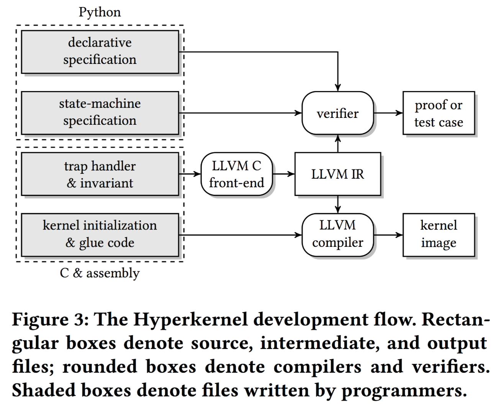
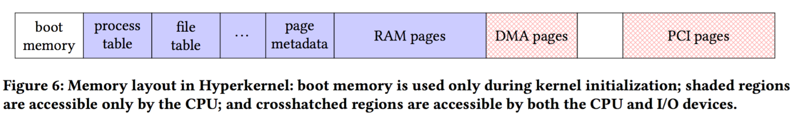

# Hyperkernel

[TOC]

## 概述

这篇文章主要是设计，实现一个工具 `Hyperkernel` ，并形式化验证了一个 OS 内核的功能正确性，它的特点在于高度自动化与验证效率很高。在形式化验证的过程中，本文秉持了三个核心观点，即

* 将内核的接口设计为有限的，即不允许没有边界的循环，或者递归。
* 分离内核和用户之间的地址空间，以便于简化虚拟内存的推理。
* 在 LLVM 中间表示形式上进行验证，避免在具有复杂语义的 C 语法上进行建模。

上述三点，其实也就是本文中遇到的核心问题

- 接口设计，需要在可用性以及自动化证明之间求取平衡。
- 虚拟内存管理，内核内存空间通常不是单射，即修改一处地址，可能会影响多处虚拟地址的内容，那么推理内核数据结构同样需要推理虚拟内存到物理内存的映射，这就非常复杂了，所以要尽可能消除这种问题。这个问题主要是使用硬件的虚拟化技术解决的。
- C 语言编写的代码很难建模，因为底层操作太多，包括指针运算，内存访问，还有一些未定义的行为，这都会使推理变得非常复杂。甚至有一些研究者认为，没有标准能够确保 C 程序不会出现 Crash。

更加具体的，本文基于 xv6 重新设计了 hyperkernel 的接口，使其可以进行自动化推理，实现了 50 个系统调用，支持了进程，虚拟内存，文件描述符等。其中接口需要满足两种级别上的规范

- 状态机的规范，给出 trap handler 的规范，描述这些实现预期的行为。
- 声明的规范，提高状态机规范的正确性的可信度，描述端到端的属性。

最后作者并使用 Z3 SMT 求解器来判断条件的成立与否。在 8 核的机器上，15min 钟就可以完成验证，并且经过实验，作者指出，Hyperkernel 可以避免类似于在 xv6 中找到的 bug。

同时，作者为了证明其可用性，移植了

- 将 xv6 的用户程序移植到了 Hyperkernel
- 一些常用功能，以及 shell
- journaling fle system
- the lwIP networking stack
- 开发了一些 Linux Binary 模拟器
- web 服务器，作为本文源代码的 git 仓库。

但是，需要注意的是本文的 `hyperkernel` 运行在单核处理器上，验证多核支持超出了本文的范围。而且本文并不会自动话内核初始化过程以及 glue code。这些部分依赖于一组自定义的 checker。

## Overview
在整个设计中，作者主要依赖于两种规范，来描述系统调用的正确性

* 功能正确性：详细的状态机规范。
* 手工检查：高层次的声明式规范。

这些代码最后都是使用 python 来进行实现的，方便与 Z3 结合。这个操作系统的系统调用部分是由 C 来实现的，由于 C 语义的复杂性，最后会使用LLVM IR 来进行形式化验证，如果验证失败的话，Z3会给一个错误的测试样例，方便开发者定位与修复。此后，未验证和已验证的代码会逐步链接一起来生成最后的 kernel 镜像。在本篇论文中，非常重要的两点就是

* 该内核是在在单核的操作系统上运行，并且关闭了中断。
* 内核用户空间与用户应用空间完全隔离。

### Finite interfaces

首先是有限的接口，即每一个 trap 的 handler 的调用长度有限，这个长度应该足够小，以便于可以扩展验证的过程，而且它应该独立于系统的参数。以 dup 为例，它每次分配会最低的可用文件描述符，那么他就需要进行搜索，并不能由一个小常数限制，因为不是一个有限的接口，因此作者将 dup 修改为了 dup(oldfd, newfd)，其中，newfd 需要用户空间自行指定，这样做的优点在于

* 具有可扩展性
* 并不限制内核的状态数，只限制记录的长度，可以包含任意多的文件描述符，可以包含任意多的页。

### Specifcations

规范方面其实还是两条

- 状态机规范，这部分是用于刻画抽象的内核状态。
- 声明的规范，这里更多的是侧重于宏观，比如仍以 fd 为例，每一个文件被引用的数量=所有进程引用它的数量的总和。

自然的不同的状态间会进行转换，即基本步骤为

* 验证参数
* 如果正确，转移到下一个状态，返回0
* 不正确，返回一个错误码，内核状态不改变

### Implementation
在 Hyperkernel 内部，dup 并不是寻找一个可用的 fd，而是直接 check。而且对于 C 代码几乎没有限制，可以使用 goto 语句，fall-through switch 语句。但与此同时，仍然需要确保 Representation invariant，类似于循环不变量，可以使用两种方法检查
* 动态检查，在进入函数处编写代码测试。
* 静态检查，在验证阶段使用 check_rep_invariant 函数进行检查。

### Verifcation

在验证部分，主要确保了两个定理，即

* 内核的实现是状态机规范的细微修改。作者通过比较 LLVM IR 中的内核数据结构与抽象的内核状态来判断实现与规范之间的差异。更具体的，本文将状态机规范和实现都转换到 SMT，检查在每一步转换时，是否按照每一步进行，如果每一步都成立，最后就成立，类似于循环不变式。
* 状态机的规范满足声明的规范。检查在每一次状态转换后是否满足声明即可。

通过这样的定理，作者认为，找到的 bug 只有以下两种，

* 实现中的 bug，要么是未定义的行为，要么是违反状态机的规范。
* 状态机中的 bug，违反声明规范。

并且，如果有 bug 的话，还会尝试去生成具体的测试用例。如果两者都正确，那么 IR 代码就正确。需要注意的是，它并不能确保

* 内核初始化
* glue code
* kernel binary

的正确性。

### 可信基本块

此外，作者指出，在本次研究中，有一些可信的基本块，包括规范，定理，内核初始化，glue code，验证器，依赖的工具链（Z3，Python，LLVM），硬件的正确性。

## Verifier

### Modeling kernel behavior

在验证器中，作者的核心观点是将状态机中内核相关的属性进行编码，确保其在 Z3 中可用。其采用的方法是对内核的执行流进行建模，构造相应的状态机。状态转换发生的时候，要求 trap handling 代码操作是原子的，即运行 trap handler 时关闭中断，直到结束再次开启。同时，DMA 可能会异步改变内存，作者采用Intel’s VT-d Protected Memory Regions 或者 AMD’s Device Exclusion Vector 的方法将 DMA 限制到一个独立的区域，以便于更好的验证。

其正确性就自然通过评估使用 python 编写的状态机规范以及在 LLVM IR 上进行穷尽的符号执行来进行判断，其使用的逆否表达式。这一点不是很理解。与此同时，声明式规范往往是一个关于抽象内核状态的断言，验证器在每次状态转换后验证是否正确即可，这时只需要计算 P 的 SMT 编码。

### Reasoning about LLVM IR

作者选择 LLVM IR 的原因为

* 相比于 C 来说，语义是简单的，而且未定义的行为更少
* 与汇编相比，保留高层的信息，比如类型，但是同时又不涉及过多的细节。

基本思想为，在 trap handler 上构造 SMT

* 在 LLVM IR 上进行符号执行
* 使用自有限化策略，展开所有循环，遍历每个代码分支。

符号执行的基本步骤
* 消除 LLVM IR 中的未定义行为
    * 即时未定义的行为，如除零错误。通过侧检查来消除。
    * 未定义的值，即未初始化的变量，使用新的符号变量来表示未定义的值，可能是任何具体的值。
    * 被污染的值，触发了一些未定义的行为，有可能是为了是优化，也有可能是一个 bug，将其视为即时未定义行为。
* 把 LLVM IR 映射到 SMT 中
    * nbit 的 LLVM 整数映射到 n 比特的 SMT 位向量
    * 常规操作，常规映射
    * 常规的内存访问映射到未解释的函数操作
    * 不稳定的内存访问被映射到一个新的符号变量，可能具有任何数值
    * 直接信任汇编指令，直接信任，建模 TLB flush 指令。
    * 指令支持
        * 支持大多数 LLVM IR 指令
        * 不支持异常，整数到指针的转换，浮点数类型，向量类型

### Encoding crosscutting properties

同时，为了达到可扩展性的验证，限制 SMT 只能使用一阶逻辑判定。不是很明白。使用了如下的基本方法

* 引用计数，为了避免不断的搜索。
* Specifying exclusive ownership，指明自己的进程的地址空间，作者提供了一个库。
* Specifying reference-counted shared ownership，指明共享资源的引用计数。如果一个对象具有引用计，那么文中就会提供相关的库。
## HyperKernel

关于 HyperKernel 最后的部分，其实很少，核心的两点还是

* 如何应用有限的接口设计
* 使得 Hyperkernel 可以自动化验证
### Design overview
具体的设计结合了一些其它设计的想法，如
* Dune
* exokernels
* seL4

具体的思想如下

* Processes through hardware virtualization
    * 内核作为一个 host
    * 用户进程作为一个 guest
    * 优点
        * 内核和用户空间具有不同的页表
        * 安全地将中断描述表暴露给了用户进程
* Explicit resource management
    * 效果
        * 用户需要明确地进行资源的申请
        * 用户自己指定，内核来检查，感觉这个又需要相信用户的能力，即增大了开发者的压力。。
    * 优点
        * 避免内核中出现循环，便于验证的可扩展性
        * 使用基于数组的数据结构
        * 回收资源通常需要循环，用户可以自己调用系统调用来进行释放空闲页
* Typed pages，三大类内存区域
    * 启动区域，只在启动的时候使用
    * 内核资源的元数据，进程，文件，用户数据
    * 不稳定区域，DMA 页面

### Designing finite interfaces

* Enforcing resource lifetime through reference counters
    * 当且仅当一个进程所有相关的引用计数都为 0 时，才可以成功消除一个进程
* Enforcing fine-grained protection
    * 使用 exokernel 的方式创建进程
    * 大部分工作交给用户空间的库
* Validating linked data structures
    * 用户空间可以自己想办法快速寻找空闲资源
### User-space libraries
* Bootstrapping，初始化代码。与 xv6 有些不同，用户空间使用 hypercall
* File system
    * 日志文件系统
    * 并没有证明
* Network
    * E1000 网络
    * 移植了 1wIP
* Linux user emulation
    * 未修改的，静态链接的 Linux binary
    * 可以运行 gzip，sha1sum，Z3
    * **可以考虑移植一个 md5sum？？？**
### Limitations
* 使用虚拟化技术，速度慢了
* 数据结构是特有设计的，并没有为详细考虑效率
* 需要有穷的接口设计
    * 许多调用并不是有穷的
* 确保的是 IR 的正确性
* xv6 的限制
    * 不支持线程
    * 写时拷贝
    * 共享页
    * UNIX 权限
* 没有多核支持
## CHECKERS
### Boot checker
* 初始时刻进行检查
* 不成功就崩溃
### Stack checker
* 运行时的问题
* 实现调用图
* 保守估计最大被 trap handler 使用的栈空间
### Link checker
* 检查不同的符号之间是否会有重叠
## EXPERIENCE

最后作者讨论了以下方面的经验

- Bug discussion，找到了许多 bug

* Development efort，花费了若干个研究者1年的时间
* Verifcation performance，8核机器使用了15min
* Run-time performance，性能还可以
* Refections on hardware support，性能与安全性需要均衡。
## 相关文献

- Z3: An Efcient SMT Solver
- Virtual Memory Man- agement in the VAX/VMS Operating System
- Verifcation of Programs in Virtual Memory Using Separation Logic
- Types, Maps and Separation Logic
- LLVM: A Compilation Frame- work for Lifelong Program Analysis & Transformation

## 个人看法

个人觉得这篇文章做的更好的是给 OS 内核验证提出了一种方法，其本身验证的系统过于简化，更像是为了验证而验证。