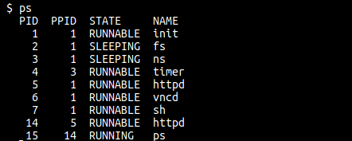

# Hyperkernel 实验

[TOC]

## 安装依赖

- Linux Ubuntu 17.10
- Binutils 2.29.1
- GCC 7.2.0
- QEMU 2.10.1

这里我只是缺少了 qemu，直接安装即可。

```shell
sudo apt install qemu
```

本文的测试环境为

```shell
➜  ~ sudo lsb_release -a  
No LSB modules are available.
Distributor ID:	Ubuntu
Description:	Ubuntu 18.04 LTS
Release:	18.04
Codename:	bionic
➜  ~ ld -v
GNU ld (GNU Binutils for Ubuntu) 2.30
➜  ~ gcc -v
Using built-in specs.
COLLECT_GCC=gcc
COLLECT_LTO_WRAPPER=/usr/lib/gcc/x86_64-linux-gnu/7/lto-wrapper
OFFLOAD_TARGET_NAMES=nvptx-none
OFFLOAD_TARGET_DEFAULT=1
Target: x86_64-linux-gnu
Configured with: ../src/configure -v --with-pkgversion='Ubuntu 7.3.0-16ubuntu3' --with-bugurl=file:///usr/share/doc/gcc-7/README.Bugs --enable-languages=c,ada,c++,go,brig,d,fortran,objc,obj-c++ --prefix=/usr --with-gcc-major-version-only --with-as=/usr/bin/x86_64-linux-gnu-as --with-ld=/usr/bin/x86_64-linux-gnu-ld --program-suffix=-7 --program-prefix=x86_64-linux-gnu- --enable-shared --enable-linker-build-id --libexecdir=/usr/lib --without-included-gettext --enable-threads=posix --libdir=/usr/lib --enable-nls --with-sysroot=/ --enable-clocale=gnu --enable-libstdcxx-debug --enable-libstdcxx-time=yes --with-default-libstdcxx-abi=new --enable-gnu-unique-object --disable-vtable-verify --enable-libmpx --enable-plugin --enable-default-pie --with-system-zlib --with-target-system-zlib --enable-objc-gc=auto --enable-multiarch --disable-werror --with-arch-32=i686 --with-abi=m64 --with-multilib-list=m32,m64,mx32 --enable-multilib --with-tune=generic --enable-offload-targets=nvptx-none --without-cuda-driver --enable-checking=release --build=x86_64-linux-gnu --host=x86_64-linux-gnu --target=x86_64-linux-gnu
Thread model: posix
gcc version 7.3.0 (Ubuntu 7.3.0-16ubuntu3) 
➜  ~ qemu-img -V     
qemu-img version 2.11.1(Debian 1:2.11+dfsg-1ubuntu7.2)
Copyright (c) 2003-2017 Fabrice Bellard and the QEMU Project developers
```

## 编译

```shell
make -j #多线程编译
```

## 基本测试

### 功能

```shell
$ sha1sum README.md
3fbd808aed24a96f8586f577b031f1ba766adcaf  README.md
$ pstree
init─┬─fs
     ├─ns─timer
     ├─httpd
     ├─vncd
     └─sh─pstree
$ wttr  
* Trying wttr.in (5.9.243.177)
GET /?0 HTTP/1.0
Host: wttr.in
User-Agent: curl

HTTP/1.1 200 OK
Server: nginx/1.9.14
Date: Mon, 04 Jun 2018 11:39:56 GMT
Content-Type: text/html; charset=utf-8
Content-Length: 354
Connection: close
Strict-Transport-Security: max-age=63072000; includeSubdomains
X-Frame-Options: DENY
X-Content-Type-Options: nosniff

Weather report: Guangzhou, China

      .-.      Light Rain Shower
     (   ).    28-33 °C       
    (___(__)   ↓ 11 km/h      
     ‘ ‘ ‘ ‘   8 km           
    ‘ ‘ ‘ ‘    0.0 mm 
```

网页版本



发现内核提供的基本命令是可以的。

如何退出 qemu

```shell
ctrl + A + X
```

这里目前使用的是虚拟机，并没有打算在真实硬件上跑。

### 验证

需要如下工具

```
Linux Ubuntu 17.10
LLVM 5.0.0
Z3 4.5.0
Python 2.7.10
```

安装 LLVM

```shell
➜  hv6 git:(master) sudo apt install llvm-5.0 clang-5.0 llvm-5.0-dev clang-5.0-dev
```

安装 z3

```shell
➜  hv6 git:(master) sudo pip install z3
```

这样不行，会出现如下错误

```shell
➜  hv6 git:(master) make hv6-verify -- -v --failfast HV6.test_sys_set_runnable
     CC_IR    o.x86_64/hv6/device.ll
     CC_IR    o.x86_64/hv6/fd.ll
     CC_IR    o.x86_64/hv6/invariants.ll
     CC_IR    o.x86_64/hv6/ioport.ll
     CC_IR    o.x86_64/hv6/ipc.ll
     CC_IR    o.x86_64/hv6/mmap.ll
     CC_IR    o.x86_64/hv6/proc.ll
     CC_IR    o.x86_64/hv6/syscall.ll
     CC_IR    o.x86_64/hv6/sysctl.ll
     CC_IR    o.x86_64/hv6/vm.ll
     GEN      o.x86_64/hv6/hv6.ll
     C++      o.x86_64/irpy/compiler/PyEmitter.o
     C++      o.x86_64/irpy/compiler/Emitter.o
     C++      o.x86_64/irpy/compiler/PyLLVMEmitter.o
     C++      o.x86_64/irpy/compiler/irpy.o
     C++      irpy/compiler/irpy
     IRPY     o.x86_64/hv6/hv6.py
Parsing took 44.655 ms.
Emitting took 17711.7 ms.
     PY2      hv6-verify
Traceback (most recent call last):
  File "o.x86_64/hv6/hv6py/kernel/spec/main.py", line 23, in <module>
    import libirpy
  File "/home/iromise/Desktop/hv6/irpy/libirpy/__init__.py", line 17, in <module>
    from ctx import newctx, initctx
  File "/home/iromise/Desktop/hv6/irpy/libirpy/ctx.py", line 18, in <module>
    import util
  File "/home/iromise/Desktop/hv6/irpy/libirpy/util.py", line 46, in <module>
    setattr(z3.AstRef, '__del__', nop)
AttributeError: 'module' object has no attribute 'AstRef'
hv6/Makefrag:169: recipe for target 'hv6-verify' failed
```

因此使用源码包的方式安装

```
# get source file from pypi, https://pypi.org/project/z3-solver/#files
wget https://files.pythonhosted.org/packages/23/40/e2340141ac1b374b3e7cc641c66ade04290676662bc80e1f40281d225b57/z3-solver-4.5.1.0.post2.tar.gz
tar -xf z3-solver-4.5.1.0.post2.tar.gz
cd z3-solver-4.5.1.0.post2
python setup.py build
python setup.py install
```

测试

```
➜  z3-solver-4.5.1.0.post2 python
Python 2.7.15rc1 (default, Apr 15 2018, 21:51:34) 
[GCC 7.3.0] on linux2
Type "help", "copyright", "credits" or "license" for more information.
>>> from z3 import *
>>> x=Int('x')
>>> y=Int('y')
>>> solve(x+y==2,x-y==2)
[x = 2, y = 0]
```

重新进行测试，可以发现

```shell
➜  hv6 git:(master) make hv6-verify -- -v --failfast HV6.test_sys_set_runnable
     PY2      hv6-verify
Using z3 v4.5.1.0
test_sys_set_runnable (__main__.HV6) ... If(Not(ULE(63, 18446744073709551615 + pid.3)),
   If(@proc_table->struct.proc::ppid.0(0, pid.3) ==
      @current.0(0),
      If(@proc_table->struct.proc::state.0(0, pid.3) == 1,
         0,
         4294967274),
      4294967283),
   4294967293)
procs_state.1(current.0)
ok

----------------------------------------------------------------------
Ran 1 test in 6.511s

OK
```

利用报错信息获取执行路径

```shell
➜  hv6 git:(master) make hv6-verify HV6.                                      
     PY2      hv6-verify
Using z3 v4.5.1.0
Traceback (most recent call last):
  File "o.x86_64/hv6/hv6py/kernel/spec/main.py", line 694, in <module>
    unittest.main()
  File "/usr/lib/python2.7/unittest/main.py", line 94, in __init__
    self.parseArgs(argv)
  File "/usr/lib/python2.7/unittest/main.py", line 149, in parseArgs
    self.createTests()
  File "/usr/lib/python2.7/unittest/main.py", line 158, in createTests
```

即从` kernel/spec/main.py` 处开始执行，所以可以根据自己的需求进行一些测试。

## 个人实验

### 戳漏洞

修改源程序，戳出来一些漏洞，如

- 文件描述符计数
- 溢出
- off-by-one，这个就不测试了。
- 错误码验证？查看验证器是否验证了返回值是否正确，尚未测试，可以随便找一个进行测试。
- 格式化字符串漏洞，kernel 中似乎也没有实现类似于 printf 之类的函数。
- 堆溢出，原文中似乎没有实现这个。

看看给的代码能不能检测出来，如果不能的话，看看能不能自己改一改，使其可以检测出来。

#### 文件描述符计数

将递减处代码删除，检查验证器是否可以通过验证？

```c
static inline void clear_fd(pid_t pid, int fd)
{
    struct proc *proc;
    struct file *file;

    proc = get_proc(pid);
    file = get_file(get_fd(pid, fd));
    proc->ofile[fd] = 0;
    //--proc->nr_fds;
```

证明出来确实出现错误

```
➜  hv6 git:(master) ✗ make hv6-verify -- -v --failfast HV6.test_sys_close       
     CC_IR    o.x86_64/hv6/device.ll
     CC_IR    o.x86_64/hv6/fd.ll
     CC_IR    o.x86_64/hv6/invariants.ll
     CC_IR    o.x86_64/hv6/ioport.ll
     CC_IR    o.x86_64/hv6/ipc.ll
     CC_IR    o.x86_64/hv6/mmap.ll
     CC_IR    o.x86_64/hv6/proc.ll
     CC_IR    o.x86_64/hv6/syscall.ll
     CC_IR    o.x86_64/hv6/sysctl.ll
     CC_IR    o.x86_64/hv6/vm.ll
     GEN      o.x86_64/hv6/hv6.ll
     C++      o.x86_64/irpy/compiler/PyEmitter.o
     C++      o.x86_64/irpy/compiler/Emitter.o
     C++      o.x86_64/irpy/compiler/PyLLVMEmitter.o
     C++      o.x86_64/irpy/compiler/irpy.o
     C++      irpy/compiler/irpy
     IRPY     o.x86_64/hv6/hv6.py
Parsing took 53.043 ms.
Emitting took 19246.8 ms.
     PY2      hv6-verify
Using z3 v4.5.1.0
test_sys_close (__main__.HV6) ... If(Not(ULE(63, 18446744073709551615 + pid.3)),
   If(Not(ULE(16, fd.3)),
      If(@current.0(0) == pid.3,
         If(@proc_table.0(0, pid.3, SignExt(32, fd.3)) == 0,
            4294967287,
            0),
         If(@proc_table->struct.proc::state.0(0, pid.3) == 5,
            If(@proc_table.0(0, pid.3, SignExt(32, fd.3)) ==
               0,
               4294967287,
               0),
            4294967283)),
      4294967287),
   4294967293)
Could not prove, trying to find a minimal ce
Could not prove, trying to find a minimal ce
Could not prove, trying to find a minimal ce
Can not minimize condition further
Precondition
ForAll(pid.0,
       Implies(And(pid.0 > 0, pid.0 < 64),
               @proc_table->struct.proc::nr_fds.0(0, pid.0) ==
               procs_nr_fds.3(pid.0)))
does not imply
```


#### 文件溢出

修改 sys_lseek 的写法如下

```c
int sys_lseek(int fd, off_t offset)
{
    fn_t fn;
    struct file *file;

    if (!is_fd_valid(fd))
        return -EBADF;
    fn = get_fd(current, fd);
    if (!is_file_type(fn, FD_INODE))
        return -EINVAL;
    if (offset < 0)
        return -EINVAL;
    file = get_file(fn);

    file->offset = offset+1000; // 将这里故意加大
    return 0;
}
```

可以看到确实检查出来对应的错误

```shell
➜  hv6 git:(master) ✗ make hv6-verify -- -v --failfast HV6.test_sys_lseek
     CC_IR    o.x86_64/hv6/fd.ll
     GEN      o.x86_64/hv6/hv6.ll
     IRPY     o.x86_64/hv6/hv6.py
Parsing took 43.972 ms.
Emitting took 18621.8 ms.
     PY2      hv6-verify
Using z3 v4.5.1.0
test_sys_lseek (__main__.HV6) ... If(Not(ULE(16, fd.3)),
   If(Not(ULE(127,
              18446744073709551615 +
              @proc_table.0(0,
                            @current.0(0),
                            SignExt(32, fd.3)))),
      If(Or(Not(0 <= offset.0),
            Not(@file_table->struct.file::type.0(0,
                                        @proc_table.0(0,
                                        @current.0(0),
                                        SignExt(32, fd.3))) ==
                2)),
         4294967274,
         0),
      4294967274),
   4294967287)
Could not prove, trying to find a minimal ce
Could not prove, trying to find a minimal ce
Could not prove, trying to find a minimal ce
Can not minimize condition further
Precondition
ForAll(fn.0,
       Implies(And(UGT(fn.0, 0), ULT(fn.0, 128)),
               @file_table->struct.file::offset.0(0, fn.0) ==
               files_offset.1(fn.0)))
does not imply
```

### 移植 md5sum

参考 https://www.uclibc.org/FAQ.html#platforms。

 首次，尝试未遂。

直接修改  `Makefrag`，如下

```

HV6_LINUX_UPROGS :=                 \
        hv6/user/linux/bench_linux  \
        hv6/user/linux/compile      \
        hv6/user/linux/gzip         \
        hv6/user/linux/hello        \
        hv6/user/linux/hello.c      \
        hv6/user/linux/hello.lua    \
        hv6/user/linux/md5sum.c      \
```

添加md5sum，之后在 qemu 中使用 tcc 进行编译。仍旧不行，缺乏文件

```
required crt1.o, crti.o
```

使用 gcc 编译似乎也不行（有一些系统调用 hyperkernel 不支持），所以还是重新归回 buildroot，编译时仍旧遇到错误

```shell
rawgcc: error trying to exec 'as': execvp: No such file or directory
```


### 完全验证

跑了一晚上，结果磁盘空间爆了。。

```shell
EEEEEEEEEEEEEEEEEEEEE................................................................................................................................................................ccccc^CTraceback (most recent call last):
  File "/home/iromise/Desktop/hv6/irpy/libirpy/server.py", line 77, in <module>
Traceback (most recent call last):
  File "/home/iromise/Desktop/hv6/irpy/libirpy/server.py", line 77, in <module>
    Server().run()
  File "/home/iromise/Desktop/hv6/irpy/libirpy/server.py", line 36, in run
    self.handle_cmd()
  File "/home/iromise/Desktop/hv6/irpy/libirpy/server.py", line 39, in handle_cmd
    cmd = self._read()
  File "/home/iromise/Desktop/hv6/irpy/libirpy/server.py", line 32, in _read
    return read_cmd(sys.stdin)
  File "/home/iromise/Desktop/hv6/irpy/libirpy/solver_utils.py", line 38, in read_cmd
Traceback (most recent call last):
Traceback (most recent call last):
```


还是得找一个服务器搞一搞。。

## 看法

- 只能说明这个实现满足这个规范，并不能说明系统没有漏洞，因为我们没有办法说明规范是正确的，，
- 我们可以将一个功能描述地尽可能清晰，但是我们无法将这个功能相关的漏洞描述的足够清晰？
- 有一些公用函数被多次使用，那么在证明对应的函数的时候，就会多次证明，如何能够避免这样的冗余证明呢？
