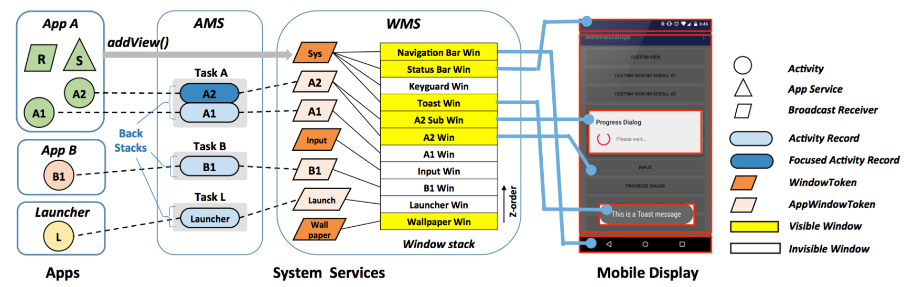
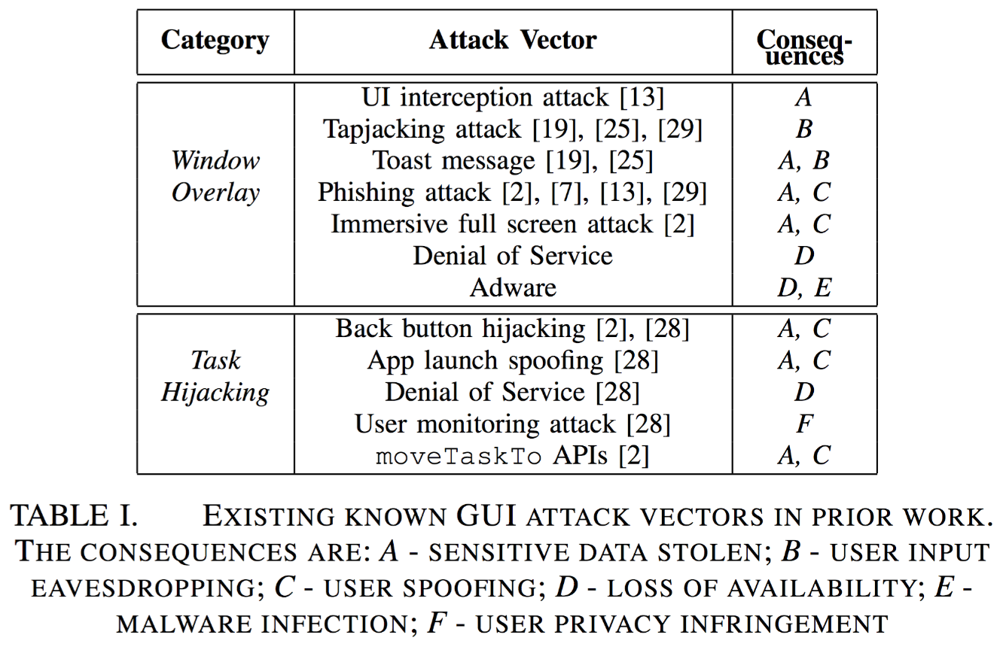

# WindowGuard: Systematic Protection of GUI Security in Android
## 概览

目前，几乎我们每天都会和手机打交道，其中使用 Android 手机的用户则更多。不可避免的，我们会和 Android UI 打交道。然而目前这部分的安全被人忽略了，而且可能会受到一系列的攻击，如

- 敏感用户信息泄漏
- 拒绝服务攻击，如锁屏。

从而影响 Android GUI 的完整性和可用性。作者指出目前已有的防御方案在有效性和实用性方面有些问题，所以急需寻找一种全面的防御方案。作者通过

1. 系统分析 Android GUI 的设计，定义了
   - 要保护的用户会话
   - 不同 Mobile GUI 环境下的合法的 GUI 系统状态
2. 提出 AWI，Android Window Integrity

利用 Xposed 实现了 WindowGuard 工具，使其可以检测目前所有已知的 GUI 攻击。

## 背景 

作者首先给了一些背景知识。

### Activity and Window

首先介绍了 Acitivity 和 Window，其中

* Activity，给用户提供一到多个窗口，每一个活动必须包含一个 window 实例，而 window 实例中包含了要展示的 GUI 内容，由开发者指定。
* windows，即为屏幕上用来展示相关的 GUI 内容的虚拟区域，目前主要有三类 window
    * App window，与一个活动相关的顶级 window
    * System window，特殊应用的窗口，如状态栏，导航栏。这类 windows 主要由系统使用，第三方的 app 也可以启动系统窗口，只要有权限。
    * Sub-window，attach 到其它两类 window 的 window
### GUI Architecture Overview

一般情况下，一个 App 的窗口的展现到屏幕上的基本顺序为

1. AMS 启动一个 app 的新的 activity
2. activity 为自己创建了一个窗口，在初始化过程中，将 window 注册到 WMS 中
3. WMS 请求 SurfaceFlinger 来渲染屏幕，返回一个 handler，与 app 共享
4. app 收到共享 handler，开始勾画 window 的整个样子，完成的时候向 SurfaceFlinger 发出信号。
5. SurfaceFlinger 会在一个 layer 栈中保持不同 window 的多个 layer，所有的都准备就绪后，开始展示在屏幕上。

这个过程主要包含了活动管理，以及 window 管理，其中 window 管理中主要有一个 z-order 属性，即不同的 window 按照 z-order 由低到高排序，当两个 window 重合的时候，只有 z-order 较高的才有机会被展示出来。

### Security Mechanisms

在 GUI 安全方面，主要有三项与其有关的安全机制，包括

* app sandboxing，确保了GUI 信息的独立性。
* binder token，确保了 GUI 信息的不可伪造，可认证。
* permission scheme，确保了 app 的能力，不可越权操作。
### Security Risks

用户在做某一些事情时，往往会访问一系列的 GUI 窗口，而原先的安全机制主要是保护进程或者 app 间的边界，所以并没有対这种环境进行保护。同时，由于移动环境的 GUI 的独特性，即

* 屏幕太小，无法显示一些安全性信息
*  GUI 的设计，App 导航的形式
* 开发者具有很高的灵活性来控制窗口的状态，而不需要收到严格的检查。

这使得 Android 的 GUI 更加容易受到攻击，目前已有的攻击可以分为两类

* Window overlay attack，部分覆盖或者全部覆盖其它 window
* Task hijacking attack，欺骗系统去修改 app 导航的恶意行为

更加细节的信息如下

作者依据已有的攻击，提出了一个安全模型，即

* 用户手机上安装了一个恶意的 APP
* 系统并没有被破坏，仍然是可信的
* 一个 window 只拥有一个主体，如果存在多个，就假设为 window 的所有者。

显然，对于攻击者而言，其目的就是影响用户的正常会话。

## ANDROID WINDOW INTEGRITY

在本部分中主要说明了用户会话为一系列的从启动器到目前访问活动的链，以及系统中不同的主体。

### Display Owner and Activity Session

作者指出，AWI 的核心原则是：默认情况下，没有应用可以修改用户的其他 app 或者系统 UI 的会话。在 Android 中，屏幕显然是一个时间共享的资源，不同的时刻，会由不同的 App 使用，为了更好地描述完整性，作者定义了 `display owner`

* 该主体为 focused 活动的 app，拥有手机的屏幕，
* 一个时刻有且仅有一个
* 其权限级别比其他的 App 高

当然一个时刻会有多个 activity 会话，他们之间也可以转换。

###  System State Legitimacy

关于系统状态的合法性，作者将这一最终判定交给用户，该软件只是单纯地检测，而并不会为用户做决定。具体的合法性约束主要包含三条

* 过去活动会话的合法性。作者指出活动会话与任务的 back stack之间区别
    * 相同点：都记录了之前的一组活动
    * 不同点：任务是保持之前活动实例的容器，一般来说，活动的顺序都会正常保持。但是，如果使用者滥用任务的特性就不一样了。而活动会话是模拟并且保存用户访问的 activity 的序列。

    所以每当 focused activity 改变的时候，activity 会话可以用来检查相关的完整性，当出现不同的时候，表明用户的视觉感受和系统状态不同，所以很有可能会有攻击，也可能是利用 task 的特性。
* 目前可见窗口的合法性。每当活动变为 focus 的并成为屏幕的拥有者时，除了本身的活动窗口，通常还有其他可见窗口。作者指出，当前可见窗口必须是以下其中之一
    * 先前拥有者 app 的窗口
    * 一组白名单窗口
        * 系统窗口
        * 其它窗口
* 未来将被被展示的窗口的合法性。在 Android 中，有很多方法可以启动一个 window。一般来说主要有两类窗口：free window，activity window。在已知了当前屏幕拥有者时，下一个启动的窗口必须属于
    * app 本身
    * 由 App 指定的白名单中的 App。
## WindowGuard

在具体的实现中，作者主要是使用了 xposed hook 了 26 个函数，其中包括AMS，WMS，PMS，System UI 相关管理的函数。具体的

* Activity session integrity。作者通过 hook AMS 相关的函数，每当 focused activity 改变的时候就执行完整性检查。
* Access control of free windows。作者通过 hook 了一系列的 WMS 函数，例如添加窗口，窗口栈排序，窗口可见性控制等函数，从而防止用户伪造，勒索软件拒绝服务攻击。
* Safeguarding focused activity transition。由于 app 转换的行为非常复杂，所以需要监控很多系统函数或者 API，比如 startActivity，windowguard 需要确保调用者的 UID 必须是当前屏幕拥有者的 UID 或者白名单中的 UID。
### Security of App Navigation “Hubs”

同时作者还需要确保以下两者的安全性

* Launcher。由于 Android 用户可能会使用第三方的 launcher，所以 WindowGuard 会询问一个包是否可以当做 launcher，一般会返回多个，由用户选择后作为所有活动会话的根，从而确保 app 被可靠地启动了。
* Recent Task List，目前 Android 认为一个任务的拥有者是由任务的根活动的 taskAffinity 来描述的，这是有问题的，WindowGuard 通过 hook 系统的 UI 来显示根活动 app 的名字或者 icon。
### Preserving User Experience

当然，在在实现功能的同时，该工具也尽可能不影响用户的体验。

## 评估

作者分别从以下三个方面进行了评估

- 有效性，阻挡了所有已知的 UI 攻击。
- 可用性，不影响用户的使用，而且方便部署。
- 性能影响，几乎不影响性能。

## 缺点
我觉得这个实现问题在于需要 Root 的手机，这对于普通用户来说几乎是不可能的。。

## 已有研究

- Peeking into Your App without Actually Seeing It: UI State Inference and Novel Android Attacks
- Touchjacking Attacks on Web in Android, iOS, and Windows Phone
- UI Redressing Attacks on Android Devices
- Towards Discovering and Understanding Task Hijacking in Android