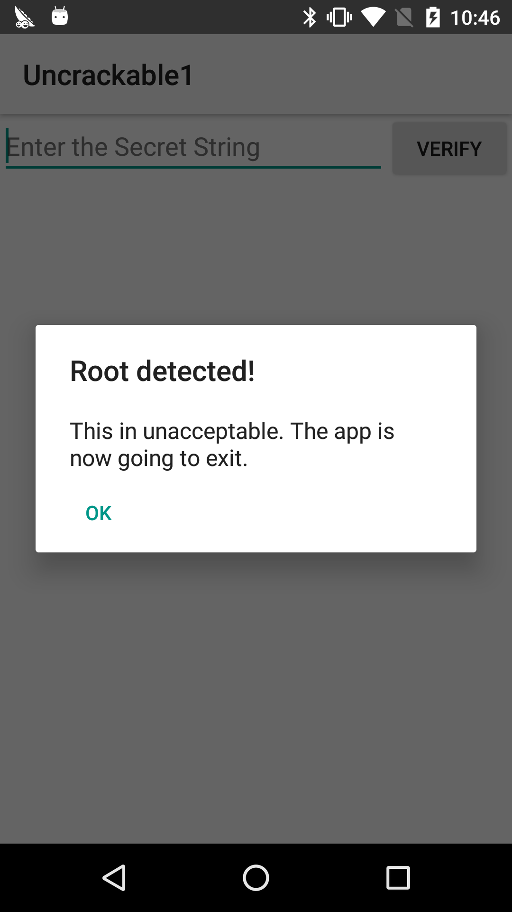

# 简介

动态插桩工具，不依赖于源码，插入

- js snippet
- library

适用于

- 开发者
- 逆向工程师
- 安全研究者

## 四大特性

### 脚本化

- 可以将脚本注入到一个黑盒进程中。
- 在不需要源码的情况下，hook 任意函数
  - 窃听加密函数的 API
  - 记录隐私的应用程序代码。
- 编辑，热保存，实时就可以看到新的结果。
- 所有的过程都既不需要重新编译程序也不需要重新启动程序。

### 可移植

几乎支持所有平台

- Windows, macOS, GNU/Linux, iOS, Android, QNX

binding

- Node.js, Python, Swift, .NET, Qt/Qml, C

### Free

意味着 Freedom，GPL。

### 严格的测试

- nowsecure 使用 frida 进行大规模的移动 app 的测试。
- 完整的测试套件，经历了一系列完整的测试样例

## 比较

|                                       | Frida | CydiaSubstrate | Substitute | Detours | Deviare | EasyHook | diStormX |
| ------------------------------------: | :---: | :------------: | :--------: | :-----: | :-----: | :------: | :------: |
|                           Open Source |   ✅   |       ❌        |     ✅      |    ❌    |    ✅    |    ✅     |    ✅     |
| Allows use in closed-source software¹ |   ✅   |       ✅        |     ✅      |    ❌    |    ❌    |    ✅     |    ✅     |
|                               Windows |   ✅   |       ❌        |     ❌      |    ✅    |    ✅    |    ✅     |    ✅     |
|                                   Mac |   ✅   |       ❌        |     ✅      |    ❌    |    ❌    |    ❌     |    ❌     |
|                                 Linux |   ✅   |       ❌        |     ❌      |    ❌    |    ❌    |    ❌     |    ❌     |
|                                   iOS |   ✅   |       ✅        |     ✅      |    ❌    |    ❌    |    ❌     |    ❌     |
|                               Android |   ✅   |       ✅        |     ❌      |    ❌    |    ❌    |    ❌     |    ❌     |
|                                   QNX |   ✅   |       ❌        |     ❌      |    ❌    |    ❌    |    ❌     |    ❌     |
|                                x86-32 |   ✅   |       ✅        |     ✅      |    ✅    |    ✅    |    ✅     |    ✅     |
|                                x86-64 |   ✅   |       ❌        |     ✅      |    ✅    |    ✅    |    ✅     |    ✅     |
|                                   arm |   ✅   |       ✅        |     ✅      |    ❌    |    ❌    |    ❌     |    ❌     |
|                                 arm64 |   ✅   |       ✅        |     ✅      |    ❌    |    ❌    |    ❌     |    ❌     |
|                                  MIPS |   ✅   |       ❌        |     ❌      |    ❌    |    ❌    |    ❌     |    ❌     |
|                     Language bindings |   ✅   |       ❌        |     ❌      |    ❌    |    ✅    |    ❌     |    ❌     |
|              Instruction-level probes |   ✅   |       ❌        |     ❌      |    ❌    |    ❌    |    ❌     |    ❌     |
|    Zero-knowledge before/after hooks² |   ✅   |       ❌        |     ❌      |    ❌    |    ✅    |    ❌     |    ❌     |
|              Transactional (batching) |   ✅   |       ❌        |     ✅      |    ✅    |    ✅    |    ❌     |    ✅     |
|               Intelligent relocation³ |   ✅   |       ❌        |     ✅      |    ❌    |    ❌    |    ❌     |    ❌     |
|           Tiny functions (code caves) |   ✅   |       ❌        |     ❌      |    ❌    |    ❌    |    ❌     |    ❌     |
|                              Rollback |   ✅   |       ❌        |     ❌      |    ✅    |    ✅    |    ✅     |    ✅     |


它最初基于 Google 的 V8  Javascript runtime，到了版本 9 之后，Frida就开始使用内部的 Duktape。

# 为什么需要

Dynamic Binary Instrumentation，可以

- 访问进程内存
- 在应用运行的时候覆盖函数
- 调用导入的类中的函数
- 寻找堆上的对象实例，并且利用它们

- Hook，记录以及拦截函数等等

内部的测试程序可以在不添加测试代码的情况下测试某些逻辑从而避免污染代码。

debug 也可以做，但是为什么不 debug 呢？

- 往往需要重新编译
- 有的 App 会检测debuger。

#  安装

## prebuild binary

```
pip install --user frida    # CLI tools and Python bindings
npm install frida           # Node.js bindings
```

## build own binary

source code

# welcome

python api

JavaScript 调试逻辑

# 基本指令

- frida-ps

# python 基本用法

python api 过于高级，有些功能可能会有所限制，更多可以参考文档中的源码实现，

- frida/core.py
- frida/tracer.py

## 枚举模块

enumerate_modules()

## 枚举内存范围

enumerate_ranges(mask)

## 读写内存

read_bytes(address, n)

write_bytes(address, data)

# 应用

- For CTF

  - 可以解决 CTF 竞赛题目

- For Fun

  - 微信掷骰子，猜拳头

- For Develop

  - 可以 debug
  - frida-trace -i "open" -U com.android.chrome
    - 追踪 chrome 的某些调用。

- r2frida

- brida

# 例子-Crackme

## 基本环境

- 主机
  - frida
  - Android 开发环境，可以使用 adb
- 手机
  - 已 root
  - Frida-server

确保 adb 安装成功以及手机正常连接

```shell
➜  ~ adb devices
List of devices attached
0606ce199f67a60c	device
```

将 Frida-server 上传到手机上

```shell
➜  apk git:(master) ✗ xz -d frida-server-11.0.8-android-arm.xz
➜  apk git:(master) ✗ ls
UnCrackable-Level1.apk          frida-server-11.0.8-android-arm
➜  apk git:(master) ✗ file frida-server-11.0.8-android-arm
frida-server-11.0.8-android-arm: ELF 32-bit LSB shared object, ARM, EABI5 version 1 (SYSV), dynamically linked, interpreter /system/bin/linker, stripped
➜  apk git:(master) ✗ adb push frida-server-11.0.8-android-arm /data/local/tmp/frida-server
frida-server-11.0.8-android-arm:... MB/s (17128848 bytes in 3.317s)
```

打开手机对应的 shell，手机启动 Frida-server

```shell
➜  apk git:(master) ✗ adb shell
shell@hammerhead:/ $ cd /data/local/tmp
shell@hammerhead:/data/local/tmp $ su
root@hammerhead:/data/local/tmp # chmod 755 frida-server
root@hammerhead:/data/local/tmp # ./frida-server
```

在主机上检查是否启动成功

```shell
➜  apk git:(master) ✗ frida-ps -U
 PID  Name
----  --------------------------------------------------
 224  adbd
3461  android.process.acore
4015  android.process.media
 208  bridgemgrd
2370  com.android.bluetooth
5042  com.android.chrome
2248  com.android.defcontainer
1399  com.android.nfc
1428  com.android.phone
4201  com.android.providers.calendar
```

注：一定不要有中文路径，否则遇到的问题就是奇奇怪怪的。。

## 开始破解

首先安装 app。

```shell
➜  apk git:(master) ✗ adb install UnCrackable-Level1.apk
UnCrackable-Level1.apk: 1 file pushed. 0.6 MB/s (61518 bytes in 0.099s)
	pkg: /data/local/tmp/UnCrackable-Level1.apk
```

在手机上打开对应的 app，可以看到该 app 检测了是否有 root



对应的截图命令为

```shell
➜  apk git:(master) ✗ adb shell screencap -p | perl -pe 's/\x0D\x0A/\x0A/g' > root-detected.png
```

如果点击 ok 的话，app 会自动退出。

下面我们使用 `jadx` 来反编译一下这个 apk，根据 Manifest 文件定位其主活动，如下

```java
public class MainActivity extends Activity {
    private void a(String str) {
        AlertDialog create = new Builder(this).create();
        create.setTitle(str);
        create.setMessage("This in unacceptable. The app is now going to exit.");
        create.setButton(-3, "OK", new b(this));
        create.setCancelable(false);
        create.show();
    }

    protected void onCreate(Bundle bundle) {
        if (c.a() || c.b() || c.c()) {
            a("Root detected!");
        }
        if (b.a(getApplicationContext())) {
            a("App is debuggable!");
        }
        super.onCreate(bundle);
        setContentView(R.layout.activity_main);
    }

    public void verify(View view) {
        String obj = ((EditText) findViewById(R.id.edit_text)).getText().toString();
        AlertDialog create = new Builder(this).create();
        if (a.a(obj)) {
            create.setTitle("Success!");
            create.setMessage("This is the correct secret.");
        } else {
            create.setTitle("Nope...");
            create.setMessage("That's not it. Try again.");
        }
        create.setButton(-3, "OK", new c(this));
        create.show();
    }
}
```

进而，我们可以看到对应的root 检查为

```java
public class c {
    public static boolean a() {
        for (String file : System.getenv("PATH").split(":")) {
            if (new File(file, "su").exists()) {
                return true;
            }
        }
        return false;
    }

    public static boolean b() {
        String str = Build.TAGS;
        return str != null && str.contains("test-keys");
    }

    public static boolean c() {
        for (String file : new String[]{"/system/app/Superuser.apk", "/system/xbin/daemonsu", "/system/etc/init.d/99SuperSUDaemon", "/system/bin/.ext/.su", "/system/etc/.has_su_daemon", "/system/etc/.installed_su_daemon", "/dev/com.koushikdutta.superuser.daemon/"}) {
            if (new File(file).exists()) {
                return true;
            }
        }
        return false;
    }
}
```

如果我们利用 Frida 来将这些检查给 hook 掉，其实我们就相当于绕过了 root 的检查。此外，我们可以发现在存在 root 的时候，会弹出一个对话框，点击 ok 对应的代码是

```java
class b implements OnClickListener {
    final /* synthetic */ MainActivity a;

    b(MainActivity mainActivity) {
        this.a = mainActivity;
    }

    public void onClick(DialogInterface dialogInterface, int i) {
        System.exit(0);
    }
}
```

即，退出 app。那么，同样的，如果我们 hook 这个函数，是不是就可以让程序不退出了呢？答案是可以的。如下

```javascript
setImmediate(function() { //prevent timeout
    console.log("[*] Starting script");

    Java.perform(function() {

      bClass = Java.use("sg.vantagepoint.uncrackable1.b");
      bClass.onClick.implementation = function(v) {
         console.log("[*] onClick called");
      }
      console.log("[*] onClick handler modified")

    })
})
```

保存为 uncrackable.js 文件，然后进行注入

```shell
➜  test frida -U -f sg.vantagepoint.uncrackable1 -l uncrackable.js --no-pause
     ____
    / _  |   Frida 11.0.0 - A world-class dynamic instrumentation toolkit
   | (_| |
    > _  |   Commands:
   /_/ |_|       help      -> Displays the help system
   . . . .       object?   -> Display information about 'object'
   . . . .       exit/quit -> Exit
   . . . .
   . . . .   More info at http://www.frida.re/docs/home/
Spawned `sg.vantagepoint.uncrackable1`. Resuming main thread!
[*] Starting script
[LGE Nexus 5::sg.vantagepoint.uncrackable1]-> [*] onClick handler modified
```

可以看到 `onClick` 的 handler 被修改了，此时再次点击ok 后，程序就不会退出了。然后我们就可以随便输入秘密字符串来进行测试了。

回过头来，再次看一下 MainActivity，我们可以看到，源程序使用了如下程序进行验证

```java
public class a {
    public static boolean a(String str) {
        byte[] bArr = new byte[0];
        try {
            bArr = sg.vantagepoint.a.a.a(b("8d127684cbc37c17616d806cf50473cc"), Base64.decode("5UJiFctbmgbDoLXmpL12mkno8HT4Lv8dlat8FxR2GOc=", 0));
        } catch (Exception e) {
            Log.d("CodeCheck", "AES error:" + e.getMessage());
        }
        return str.equals(new String(bArr));
    }

    public static byte[] b(String str) {
        int length = str.length();
        byte[] bArr = new byte[(length / 2)];
        for (int i = 0; i < length; i += 2) {
            bArr[i / 2] = (byte) ((Character.digit(str.charAt(i), 16) << 4) + Character.digit(str.charAt(i + 1), 16));
        }
        return bArr;
    }
}
```

这个程序本身也比较简单，我们可以直接进行逆向来获取，但是我们还可以继续使用 hook 的方法，hook 对应的函数 `sg.vantagepoint.a.a.a`，让程序自己输出对应的秘密值。

这时，重新启动程序，再次注入

```shell
➜  test frida -U -f sg.vantagepoint.uncrackable1 -l uncrackable.js --no-pause
     ____
    / _  |   Frida 11.0.0 - A world-class dynamic instrumentation toolkit
   | (_| |
    > _  |   Commands:
   /_/ |_|       help      -> Displays the help system
   . . . .       object?   -> Display information about 'object'
   . . . .       exit/quit -> Exit
   . . . .
   . . . .   More info at http://www.frida.re/docs/home/
Spawned `sg.vantagepoint.uncrackable1`. Resuming main thread!
[*] Starting script
[LGE Nexus 5::sg.vantagepoint.uncrackable1]-> [*] onClick handler modified
[*] sg.vantagepoint.a.a.a modified
[*] onClick called
[*] Secret String: I want to believe
```

可以看到，对应的秘密字符串为 `I want to believe`，这时在进行输入就可以通过验证了。当然，我们甚至可以hook 判断函数，使其无论如何都返回正确。